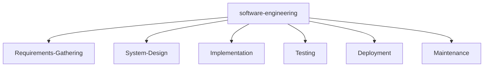

<!--   my-icons -->
<p align="center">
    <a href="https://github.com/MeiSiristhebest"></a>
    <a href="https://github.com/oracle/graalvm-ce-java23"></a>
    <a href="https://www.python.org/downloads/release/python-3130/"></a>
    <a href="https://golang.org/dl/go1.21.5.linux-amd64.tar.gz"></a>
<!--     <a href="https://github.com/MeiSiristhebest/graphs/contributors"></a> -->
    <a href="https://github.com/MeiSiristhebest/stargazers"></a>
<!--     <a href="https://github.com/MeiSiristhebest/network/members"></a> -->
       
</p>

<!--   my-header-img -->


<a href="https://www.oracle.com/java/technologies/javase-jdk23-downloads.html"></a>
<a href="https://www.python.org/"></a>
<a href="https://golang.org/"></a>

<!--   my-ticker -->    
[](https://git.io/typing-svg)

<!--   my-skills -->

| Property                                        | Data                                                         |
| ----------------------------------------------- | ------------------------------------------------------------ |
| **Language / IDE**                              |           |
| **Domain Knowledge**                            |              |
| **CI / CD**                                     |     |
| **Databases**                                   |   |
| **OS**                                          |   |
| **Tools & Platform**                            |          |
| **Machine Learning / Deep Learning Frameworks** |     |

<!--   GitHub stats graph -->

### 📈 GitHub Activity Graph:
<!-- -->
<!--   green snake -->


| .                                                            | .                                                            |
| ------------------------------------------------------------ | ------------------------------------------------------------ |
|  |  |

</img>

<!--   profile-green-animate -->


<!--   grid-snake -->

<!-- dark snake -->


<!--  2d history skills -->
<!-- </img> -->
</img>


**📫 How to Reach me:**
<p align="left">
<a href="tencent://message/?uin=1534572236" target="blank"></a>
<a href="https://wechat.com/ReadLine" target="blank"></a>
<a href="mailto:1534572236@qq.com" target="blank"></a>
</p>

<div align="center">
<summary>Trophy: Github Profile Trophy</summary>
</div>

<p align="center"> 
<a href="https://github.com/ryo-ma/github-profile-trophy"></a>
</p>


   <!--machine-learning-->


 


<div align="center">
<summary>Trophy: Hackerrank Profile Trophy</summary>
</div>

<p align="center"> 

 

</p>


<!-- Belarus - My Home-->

 ```geojson

{
  "type": "FeatureCollection",
  "features": [
    {
      "type": "Feature",
      "id": 1,
      "properties": {
        "ID": 0
      },
      "geometry": {
        "type": "Polygon",
        "coordinates": [
          [
            [115.4183, 39.4653],
            [117.5942, 39.4653],
            [117.5942, 40.9189],
            [115.4183, 40.9189],
            [115.4183, 39.4653]
          ]
        ]
      }
    }
  ]
}

 ```


<p align="center"> 


</p>


#### Thanks for visiting :heart:

<p align="center"> 
  

counting of visitors to this page in this section started from May 8, 2022
<a href="http://s01.flagcounter.com/more/ap7"></a>
</p>

## Star History

[](https://star-history.com/#MeiSiristhebest/MeiSiristhebest&Date)

### Profile Views
counting of visitors to this page in this section started from June 12, 2022


</br>

[MIT](LICENSE)


Would you like to meet me?

If you want to contribute to any of my repositories, feel free to submit PRs, issues and email me. Pick a slot if you'd like to meet me and chat about proposals and ideas - but make sure to describe the agenda

---
*I use an automatic subscription control system. Thus, everyone who subscribes to me, I will subscribe to those and I will respond, and vice versa, I will remove all those who unsubscribe from me from among those who should be followed.* 
---


