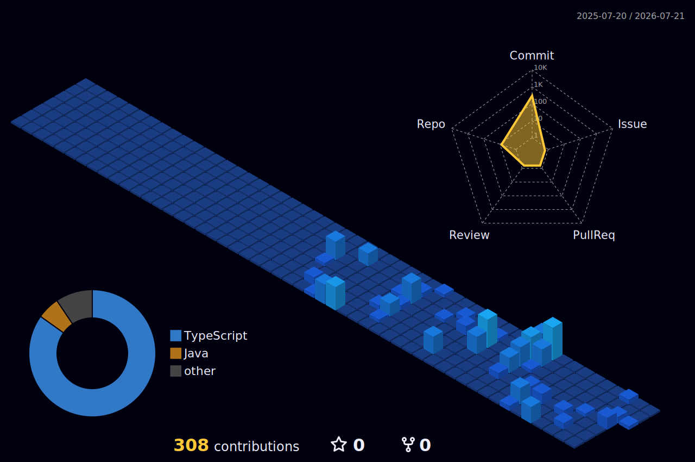

<!-- Header Wave Banner -->

  

   

  <!-- Dynamic Typing Title -->
  

    

  <!-- 📬 1. 极客可点击 Channel 标签 (更新 Email) -->
  &nbsp;&nbsp;

---

### 💡 About Nefelibata

> **Nefelibata** *(n.)* 
> *A cloud walker; one who does not obey the conventions of society, literature, or art, but follows their own path.*

I write code to document thoughts, capture time, and build tiny virtual spaces that feel alive. I don't fit into a single box. Today I might be designing a minimalist user experience; tomorrow I could be deep in a network protocol trace or exploring the latent space of generative models. 

To me, software engineering is not just about solving tickets — it is a form of craftsmanship, a canvas where logic meets intuition.

*   🌌 **Aesthetic & Order**: Passionate about minimalist design, architectural neatness, and finding order within high-entropy systems.
*   ☕ **Beyond the Console**: I spend my free time exploring street photography, game mechanics, philosophy, and urban history.
*   🎯 **Current Focus**: `LLM Agent Workflows (MCP / Harness Eng)` · `High-Concurrency Microservices`

---

### 💻 Technical Spectrum

<!-- 分类矢量 Skillicons 图标墙 -->

  <!-- Languages & Core Frameworks -->
  
    
  <!-- Infra, Cloud & Developer Tooling -->
  

---

### 🚀 Featured Projects

#### 🎙️ [TimeLog](https://github.com/MeiSiristhebest/TimeLog)
> **A local-first voice diary that transcribes and indexes your thoughts.**
*   **Tech Stack**: `Python` · `Silero VAD` · `Deepgram STT/TTS` · `MMKV`
*   **Key Highlights**: Continuous **30-min streaming voice interaction**, **100+ local story logs**, sub-millisecond local caching latency.

#### 🛍️ [Ningxiangshop](https://github.com/MeiSiristhebest/ningxiangshop)
> **A distributed e-commerce system built to explore high-concurrency microservices.**
*   **Tech Stack**: `Java` · `Spring Cloud` · `Nacos` · `Seata` · `Sentinel` · `Redisson`
*   **Key Highlights**: **QPS 5000+** stress-tested, **Zero-overselling** distributed lock patterns, 3-tier Sentinel fallback protection.

#### 🥗 [Recipe Planner App](https://github.com/MeiSiristhebest/recipe-planner-app)
> **A cross-platform meal planning and sharing assistant built in a high-performance monorepo.**
*   **Tech Stack**: `Turborepo` · `TypeScript` · `React Native / Expo` · `Node.js`
*   **Key Highlights**: Monorepo architecture managing client/server packages with **17M+ lines of structured code**.

#### 💬 [youju](https://github.com/MeiSiristhebest/youju)
> **An AI-powered risk analysis assistant that detects loopholes in contracts and chat transcripts.**
*   **Tech Stack**: `React` · `Vite` · `Express` · `TypeScript` · `Gemini API`
*   **Key Highlights**: Automated risk loophole scanner with structured draft confirmation script generation.

#### 🔮 [mystic](https://github.com/MeiSiristhebest/mystic)
> **A Gemini-powered agent application designed and deployed on Google AI Studio.**
*   **Tech Stack**: `Google AI Studio` · `Gemini Stream API` · `Prompt Context Pipeline`
*   **Key Highlights**: Local context constraint control with structured streaming response handling.

---

### 📊 Digital Footprint & Streaks

<!-- 💡 静态高质感极客勋章组 -->

  
  
  

 

<!-- 💡 100% 稳定永不裂图的成就勋章墙 (包含 Genesis 创世纪成就、19M+ 代码行数勋章、700+ Commits 勋章) -->

  <h4>🏆 Achievements & Milestones</h4>
   
  
  
  
  

 

<!-- 💡 免维护 Streak 连续贡献天数动态卡片 -->

  

 

<!-- 💡 极客活跃度曲线图 (调优为 Tokyonight 暗黑蓝调主题，与页面完美融合) -->

  

 

---

 

<!-- 💡 3D 水晶日历城堡（暗黑纯净模式，零遮挡零截断） -->

  <h4>🏰 3D Crystal Calendar</h4>
   
  

 

---

 

<!-- 💡 全景统计看板（0 Error 模式，包含 1900 万行代码修改量 & 多语言饼图） -->

  

 

---

 

<!-- 💡 贪吃蛇贡献图 -->

  <h4>🐍 Code Journey (Contribution Snake)</h4>
   
  <picture>
    <source media="(prefers-color-scheme: dark)" srcset="./github-contribution-grid-snake-dark.svg" />
    <source media="(prefers-color-scheme: light)" srcset="./github-contribution-grid-snake.svg" />
    
  </picture>

