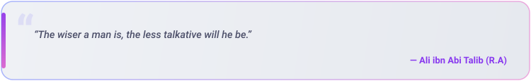
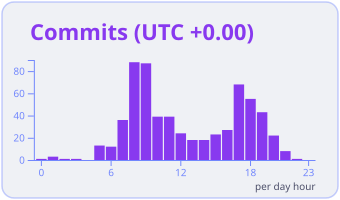

<!-- 
  Designed with ❤️ by Nefelibata (https://github.com/MeiSiristhebest)
  If you find this profile aesthetic or use this template, please drop a ⭐ Star!
-->
<!-- Header Wave Banner -->

  

   

  <!-- Dynamic Typing Title -->
  

    

  <!-- 📬 Contact Badges (Catppuccin Palette) -->
  &nbsp;&nbsp;

---

### 💡 About Nefelibata

> **Nefelibata** *(n.)*  
> *A cloud walker; one who does not obey the conventions of society, literature, or art, but follows their own path.*

I write code to document thoughts, capture time, and build tiny virtual spaces that feel alive. I don't fit into a single box. Today I might be designing a minimalist user experience; tomorrow I could be deep in a network protocol trace or exploring the latent space of generative models.

To me, software engineering is not just about solving tickets — it is a form of craftsmanship, a canvas where logic meets intuition.

*   🌌 **Aesthetic & Order**: Passionate about minimalist design, architectural neatness, and finding order within high-entropy systems.
*   🔭 **Cosmos & Exploration**: Deeply captivated by observational astronomy, celestial ephemeris, and planetary dynamics.
*   ☕ **Beyond the Console**: 
    - 📖 *Mind & Humanities*: History, philosophy, reading, and cinema.
    - 🎮 *Interactive Arts & Play*: Competitive gaming, music, anime/ACG culture, and football (soccer).
*   🎯 **Current Focus**: `LLM Agent Workflows (MCP / Harness Eng)` · `High-Concurrency Microservices`

 

<!-- 💡 Daily Geek Quote Card -->

  

---

## 🌐 Open-Source Contributions

<table>
  <tr>
    <td width="50%" valign="top">
      <h3><a href="https://github.com/bytedance/deer-flow">ByteDance Deer-Flow</a> · 4 Merged PRs</h3>
      
Hardened memory subsystem against non-finite timeout values (rejecting <code>NaN</code> / <code>+Inf</code>), resolved cross-platform skill projection issues, and prevented garbage collection of deferred subagent cleanup tasks.

      <a href="https://github.com/bytedance/deer-flow/pulls?q=is%3Apr+author%3AMeiSiristhebest+is%3Amerged">View contributions →</a>
    </td>
    <td width="50%" valign="top">
      <h3><a href="https://github.com/TencentCloud/CubeSandbox">Tencent Cloud CubeSandbox</a> · 2 Merged PRs</h3>
      
Ensured precise gRPC worker connection teardown across full and prefixed routing keys, and fixed zero <code>EndAt</code> timestamp boundaries for non-expiring sandboxes.

      <a href="https://github.com/TencentCloud/CubeSandbox/pulls?q=is%3Apr+author%3AMeiSiristhebest+is%3Amerged">View contributions →</a>
    </td>
  </tr>
  <tr>
    <td width="50%" valign="top">
      <h3><a href="https://github.com/alibaba/open-code-review">Alibaba OpenCodeReview</a> · 3 Merged PRs</h3>
      
Refined Agent skill instructions to prevent TTY output stream truncation, supported cross-platform subpath queries in <code>file_find</code>, and ensured background memory compression tasks join before session finalization.

      <a href="https://github.com/alibaba/open-code-review/pulls?q=is%3Apr+author%3AMeiSiristhebest+is%3Amerged">View contributions →</a>
    </td>
    <td width="50%" valign="top">
      <h3><a href="https://github.com/microsoft/markitdown">Microsoft MarkItDown</a> · Merged</h3>
      
Hardened Azure Document Intelligence client initialization against default API version regressions in Microsoft core document conversion library.

      <a href="https://github.com/microsoft/markitdown/pulls?q=is%3Apr+author%3AMeiSiristhebest+is%3Amerged">View contributions →</a>
    </td>
  </tr>
  <tr>
    <td width="50%" valign="top">
      <h3><a href="https://github.com/microsoft/FLAML">Microsoft FLAML</a> · Merged</h3>
      
Aligned time-series forecasting model configurations and fixed execution variable mismatches in Microsoft AutoML library.

      <a href="https://github.com/microsoft/FLAML/pulls?q=is%3Apr+author%3AMeiSiristhebest+is%3Amerged">View contributions →</a>
    </td>
    <td width="50%" valign="top">
      <h3><a href="https://github.com/ManimCommunity/manim">Manim Community</a> · 2 Merged PRs</h3>
      
Fixed 3Blue1Brown mathematical animation engine crashes on parallel lines in <code>Angle</code> and resolved collinear vertex failures in <code>round_corners()</code>.

      <a href="https://github.com/ManimCommunity/manim/pulls?q=is%3Apr+author%3AMeiSiristhebest+is%3Amerged">View contributions →</a>
    </td>
  </tr>
  <tr>
    <td width="50%" valign="top">
      <h3><a href="https://github.com/earendil-works/pi">Pi Agent Engine</a> · Merged</h3>
      
Hardened network proxy resolution to accurately match both root domains and recursive subdomains in standard <code>NO_PROXY</code> environment specifications.

      <a href="https://github.com/earendil-works/pi/pulls?q=is%3Apr+author%3AMeiSiristhebest+is%3Amerged">View contributions →</a>
    </td>
    <td width="50%" valign="top">
      <h3><a href="https://github.com/stenolabs/stenoai">Steno AI</a> · 4 Merged PRs</h3>
      
Hardened Ollama automated download pipelines with resilient retry/fail semantics, restored script execution permissions, and expanded cross-platform Windows documentation.

      <a href="https://github.com/stenolabs/stenoai/pulls?q=is%3Apr+author%3AMeiSiristhebest+is%3Amerged">View contributions →</a>
    </td>
  </tr>
</table>

Contribution records above link directly to verified merged PR queries across official repositories.

---

### 💻 Technical Spectrum

<!-- Category Skillicons Wall (Hierarchically Sorted & Grouped) -->

  <!-- Layer 1: Core Languages & High-Performance Runtimes (Backend -> Multi-Paradigm -> Runtimes -> Web Markup) -->
  
    
  <!-- Layer 2: Frameworks & Rendering Systems (Enterprise Backend -> UI Frameworks -> Meta-Frameworks -> 3D Graphics -> Styling) -->
  
    
  <!-- Layer 3: Cloud, Database & Infrastructure Tooling (Containers & OS -> RDBMS & Cache -> CI/CD & Shell) -->
  

---

### 🚀 Featured Projects

#### 🌟 [OpenContrib](https://github.com/MeiSiristhebest/opencontrib)
> *Modular open-source contribution infrastructure for autonomous AI coding agents.*
*   **Tech Stack**: `TypeScript` · `Bun` · `Model Context Protocol (MCP)` · `ast-grep` · `Git Worktrees`
*   **Engineering Highlights**:
    - **Deterministic Domain Engine**: 24 CLI subcommands and 34 MCP tools providing AI agents with defect probes, sandboxes, and RFC-100 governance.
    - **Empirical Evidence & Triage**: Dual-stage verification with concurrent contention testing and 150-token Smart Pointer slice dereferencing.

#### 🛍️ [Ningxiang Go](https://github.com/MeiSiristhebest/ningxiangshop)
> *Enterprise-grade distributed microservice e-commerce system built for high-concurrency scenarios.*
*   **Tech Stack**: `Java 21 (LTS)` · `Spring Boot 3.3` · `Spring Cloud Alibaba` · `RocketMQ` · `Redis` · `Vue 3`
*   **Engineering Highlights**:
    - **High-Concurrency Architecture**: Global Java 21 virtual threads, zero-RPC gateway auth offloading, and Redisson watchdog anti-overselling locks.
    - **Multilevel Caching**: L1 Caffeine + L2 Redis annotation-driven cache with RocketMQ broadcast invalidation.

#### 🔮 [Mystic](https://github.com/MeiSiristhebest/mystic)
> *Multi-domain interpretable AI reasoning suite powered by deterministic ephemeris and evidence graph arbitration.*
*   **Tech Stack**: Next.js 16 · React 19 · TypeScript · Vercel AI SDK · Moshier Ephemeris
*   **Engineering Highlights**:
    - **4-Tier Decoupled Architecture**: Strictly isolates deterministic domain rules from LLM generation to eliminate hallucination.
    - **Canonical Evidence Graph (CEG)**: Deterministic multi-dimensional evidence scoring and cross-domain temporal conflict arbitration.

#### 💬 [YouJu](https://github.com/MeiSiristhebest/youju)
> *AI-powered contract loophole & conversation risk analysis workbench (TRAE AI Creativity Contest Featured Project).*
*   **Tech Stack**: `React 18` · `Express` · `TypeScript` · `TailwindCSS` · `Zod` · `Gemini API`
*   **Engineering Highlights**:
    - **5-Layer DDD Clean Architecture**: Strict domain boundaries with runtime Zod schema validation and self-reflection loops.
    - **Transparent Risk Dashboard**: 3-tier risk classification with actionable remediation and offline deterministic heuristic fallback.

#### ⚡ [tiktok-backend-go](https://github.com/MeiSiristhebest/tiktok-backend-go)
> *High-concurrency video feed and social interaction backend service (ByteDance Youth Camp).*
*   **Tech Stack**: `Golang` · `Gin` · `GORM` · `MySQL` · `Redis`
*   **Engineering Highlights**:
    - **Feed & Relation Pipeline**: High-throughput video stream querying, user interaction caching, and relation graph transaction handling.
    - **Storage Optimization**: Multi-tier Redis caching and MySQL indexing strategies for low-latency social feed delivery.

#### 🎙️ [TimeLog](https://github.com/MeiSiristhebest/TimeLog) & [timelog-web](https://github.com/MeiSiristhebest/timelog-web)
> *Local-first voice diary & cross-generational family story preservation suite.*
*   **Tech Stack**: `React Native (Expo)` · `Next.js` · `SQLite` · `Supabase` · `Silero VAD`
*   **Engineering Highlights**:
    - **Local-First Audio Engine**: Streaming voice activity detection (Silero VAD) with offline SQLite synchronization.
    - **Cross-Platform Console**: Next.js web curation dashboard backed by Supabase storage and row-level security.

---

### 📊 GitHub Activity & Metrics

  <table>
    <tr>
      <td width="50%" align="center" valign="middle">
        
      </td>
      <td width="50%" align="center" valign="middle">
        
      </td>
    </tr>
    <tr>
      <td width="50%" align="center" valign="middle">
        
      </td>
      <td width="50%" align="center" valign="middle">
        
      </td>
    </tr>
  </table>

  

<!-- 💡 Catppuccin Contribution Activity Snake -->

  <picture>
    <source media="(prefers-color-scheme: dark)" srcset="./assets/github-contribution-grid-snake-dark.svg" />
    <source media="(prefers-color-scheme: light)" srcset="./assets/github-contribution-grid-snake.svg" />
    
  </picture>

  

  💡 <i>Liked the portfolio design or found the open-source projects helpful? Consider giving a ⭐ to support the journey!</i>

<!-- 👥 Profile Views Counter -->

  <h3>👀 Profile Views</h3>
  

<!-- Scarf Telemetry Pixel -->

